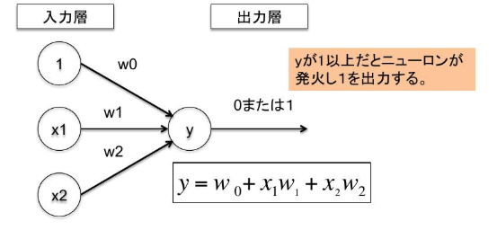
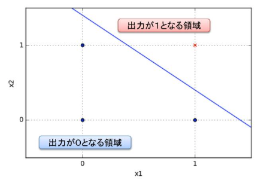
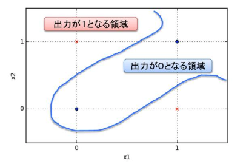
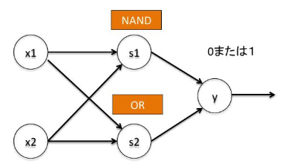
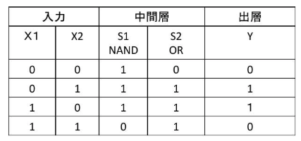
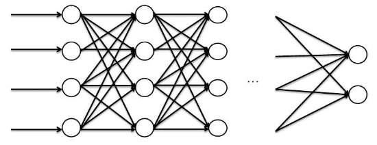

# エンジニアのための今更聞けないAI/機械学習入門

## AI活用時代
- 第3次AIブーム
    - Google AlphaGo:以後のチャンピオンに勝利
    - IBM Watson
    - お掃除ロボなどのAI搭載家電:ルンバ
    - AIが身近なものに

## エンジニアに必要な能力
- AIの知識
  - AIのアルゴリズムの理解
  - AI向けフレームワークの利用法
- データを整理・加工
  - データ分析
  - スクレイピング
  - データベース技術

## AI(人工知能とは)
- 人工知能:Artificial Interlligence
- 人間の知的能力をコンピュータ上で実現する技術やソフトウェア，コンピュータシステムのこと
- AIプログラム
  - 従来のプログラムは条件分岐など判断ロジックを作成
  - AIプログラムは計算モデルを定義し，データを与えると自動的に推論を行う
- 汎化型AI
  - 人間と同じように自動的に学習し，考え判断する人工知能
  - SF映画に登場するロボットなど
  - 実現化はされていない
- 特化型AI
  - 人間の一部の作業を自動的に行う人工知能
  - 画像，音声分析などなにかに特化したものを行う

- 機械学習とは
  - 特化型AIの手法の1つ
  - 人間が自然に行なっている学習能力と同等の機能をコンピュータで実現しようとする技術
- ニューラルネットワーク
  - 機械学習の手法の1つ
  - 脳の神経細胞の機能を模した数理モデル
  - ディープラーニングなど
- 深層学習(ディープラーニング)
  - ニューラルネットワークを基礎とした学習手法
  - 畳み込みニューラルネットワーク(CNN),李カレントニューラルネットワーク(RNN)などのアルゴリズムがある
  - 専用フレームワークを使えば，容易にプログラミングができる

## 機械学習の概要
- あるなしクイズ
  - ある/なしを区別するルールを与えられたデータから見つける
  - 未知のデータに対して，ルールを適用し予測する
  - 上記のことを教師あり機械学習
  - ヒントとなる過去の事例(訓練データ)が必要
  - 入力xが与えられた時に出力yを予測するy=f(x)となる関数fをみつける
- 仲間はずれ探しクイズ
  - ある視点で対象をグループ分けする
  - 対象データから隠れた構造を発見する
  - 以上のことを教師なし機械学習
  - 入力のみ与えられ，出力を自前で作りグループ分けする
  - 出力の値が近いものをグループとしてまとめる
- 入力の表現
  - 入力値は入力の特徴データの特徴を抜き出し数値化する．数値化したデータを特徴量と呼ぶ
  - どのように特徴量を決めるかは，学習問題の領域ごとに多様な方法がある
  - データの量・質と特徴量を決めるのは人間
- 生データ -> 特徴量抽出 -> 機械学習 -> モデルの評価 -> モデルの運用

## 深層学習の基礎
- ニューロンの仕組み
  - 樹状突起で他ニューロンからの情報を受け取る
  - 細胞体の電位が上昇
  - 電位がある閾値を超えるとシナプスからパルス信号を送出(発火)
- パーセプトロンの仕組み

  - wは各入力の重要度を示す重み．w0は発火しやすさを調節する**バイアス**と呼ばれる

- AND演算を行うパーセプトロン
  - w0=0.4,w1=0.4,w2=0.4

- XOR演算を行うパーセプトロン

  - 単層パーセプトロンは非線形の問題には対応できない

- s1でNAND,s2でORの計算,yではANDを行うことでXORを実現できる

- XOR演算を行う2層パーセプトロン

  - 層を重ねることで非線形問題に対応できる

- ディープニューラルネットワーク

## AIと産業との関連性
- ニュースを書く読むAI
  - 企業の業績データなどの要点を抽出し，記事を自動作成する
  - 気象電文から天気予報のニュース原稿を自動作成するAI
  - 用意した原稿を自動的に読み上がるAIを利用し，ニュースを放送する
- 業務を支援するAI
  - 新卒採用の書類選考にAIを導入
  - コールセンターの問い合わせ内容を音声認識し，データベースから最も適した回答を抽出
- 街のパン屋
  - トレーに乗せられたパンを瞬時に識別し計算するAI
- 農家
  - 収穫したキュウリの選別にAIを活用
  - きゅうりがまっすぐか曲がっているかをカメラから読み取り認識して選別する

## AIの技術発展の方向性
- ハードウェアの進化
  - 学習計算はGPUで計算
  - 学習データが増え，即応性が求められる
  - AI専用チップの開発が進んでいる
  - 量子コンピュータが実用化され，AIがさらに発展すると言われている
- 学習アルゴリズムの進化
  - 新しいアルゴリズムが誕生
- 法律，制度など
  - AIによる自動運転で事故を起こしたら責任はどこにある?
  - AI利用で便利で豊かな世界ができるが悪用することもできる
