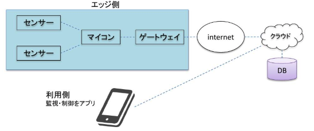
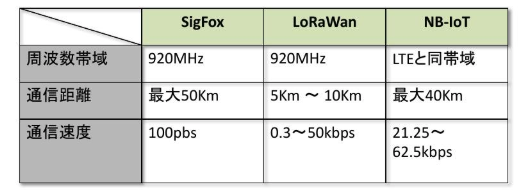
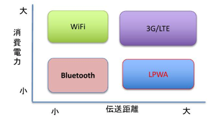
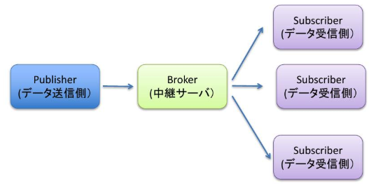

# エンジニアのための今更聞けないIoT入門
## IoT活用時代
- IoT活用時代の到来
  - 第四次産業革命の到来と言われている
  - 自動運転の実用に向けて各メーカーが実験開始
  - Google Homeなどスマートデバイスが普及
  - 介護，物流産業などの人手不足の切り札になるかも
- IoT市場の拡大
  - 2020年には500億台以上のモノがインターネットに繋がると言われている

## エンジニアに必要とされる能力
- 今後のIT開発
  - より変化のスピードが速くなり，従来のウォータフォール型の開発手法では対応できない
  - エンジニアの役割，働き方の変化が起きるのは必死
  - 車内で決められた業務だけ行なっていると遅れを取ってしまう
- IoT開発は多くの技術要素が必要
  - IoTデバイスに関する技術
  - ネットワーク技術
  - クラウド利用
  - データ加工，分析能力
  - AIプログラミング
- IoT開発はスキルだけでなく課題解決能力
  - 多くの要素が関わる為，コーディネートできる能力
  - チームワークを発揮できるコミュニケーション能力
  - プロダクト開発の勧められる，マネージメント能力

## IoTとは
- IoT:Internet of Things
  - IoTの実現をインターネットに多様かつ多数のものが接続され，及びそれらのものから送信され，またはそれらのものに送信される大量の情報の円滑な流通が国民生活及び経済活動の基盤となる社会の実現
- 集中と分散
  - メインフレームへ集中(ホストコンピュータに端末でアクセス/データはメインフレームで集中管理)
  - PCを利用したC/Sシステムへ分散(パソコンが安価に/データはサーバに保存)
  - Web,クラウドへ集中(サーバでプログラムを実行)
  - スマホアプリ，IoTの普及で分散
  - 分散:エッジコンピューティング

## IoTを実現する技術

- エッジデバイス
  - シングルボードコンピュータ
    - 1舞の回路基板にコンピュータとして機能する部品(CPU,メモリなど)を搭載したもの
  - ワンボードマイコン
    - むき出しの1枚のボードの上に，電子部品と最低限の入出力装置をつけただけの極めて簡素なマイクロコンピュータである
- Raspberry Pi:ARMプロセッサを搭載したシングルボードコンピュータ
- OpenMV:写真撮影，顔検出,QRコード読み取りなどの機能が利用できる小型のマイコン
- センサー
  - 温度，湿度，気圧，磁気
  - 赤外線，超音波，放射線，圧力
  - GPS，加速度，近接
  - 心拍，脳波，指紋
- 無線通信技術
  - LPWA
    - 省電力で広域をカバーできるモバイル・ネットワークである．LTEのようなセルラー回線は，端末側に多くの電力が必要となる
    - 主な企画
      - SIGFOX
      - LoRaWAN
      - NB-IoT
- LPWAの企画

- 無線通信技術

- 通信プロトコル
  - IoTデバイス間の通信は，消費電力や通信帯域制限により，効率的なパケット送信ニーズがある
  - HTTPではオーバーヘッドが大きい
  - IoT向けの通信プロトコルを使用する
- MQTTプロトコル
  - TCP/IPで動作するプロトコル
  - HTTPに比べヘッダが小さい(最小2Byte)
  - FacebookMessengerがMQTTを使用
  - パブリッシュ/スクライブ型の通信

- CoAPプロトコル:Constrained Application Protocol
  - 簡易HTTP
  - トランスポート層にUDPを使用し通信

## IoTと産業との関連性

## IoTの技術の発展方向性
