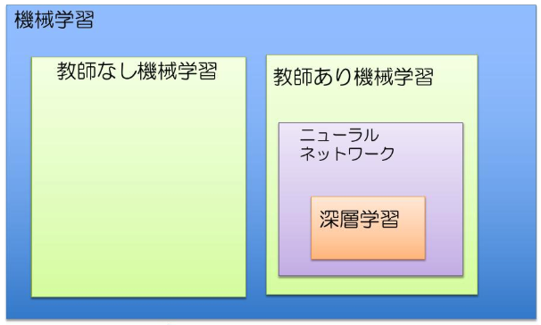

# Pythonで学ぶ機械学習/ディープラーニング実践 1回

## 機械学習とは

- 深層学習3大アルゴリズム
  - CNN(畳み込みニューラルネットワーク)
    - 動物の視覚野の仕組みから着想を得た画像認識に優れたアルゴリズム
  - RNN(リカレントニューラルネットワーク)
    - 時系列なデータを学習させ，過去のデータから予測，分類するアルゴリズム
    - 株価/会話/翻訳/音声認識
  - オートエンコーダ
    - 入力と出力が同じになるように特徴を学習するアルゴリズム
    - 画像のノイズを取り除く

## 機械学習で使う数学
- 微分
  - $$ f'(x) = \lim_{\Delta x \to 0} \frac{f(x + \Delta x) - f(x)}{\Delta x}$$
  - という数式で表す．ある曲線の任意の点での接線の傾きを表す
- 偏微分
  - ある関数 $$ f(x,y) = z $$ を微分は，各変数に対して微分を行う．各変数(x,y)に対して微分することを偏微分と呼ぶ
  - $$ \frac{\delta z}{\delta x} = \lim_{\Delta x \to 0}\frac{f(x + \Delta x, y) - f(x,y)}{\Delta x}$$
  - $$ \frac{\delta z}{\delta y} = \lim_{\Delta y \to 0}\frac{f(x, y + \Delta y) - f(x,y)}{\Delta y}$$

- ベクトル
  - ベクトルとは向き，大きさを持つ量
  - $$
    a = \begin{pmatrix}
      a_1 \\
      a_2 \\
      \vdots \\
      a_n
    \end{pmatrix}

  - $$ \vec{a} = (a_1, a_2, \cdots, a_n) $$

- ベクトルの演算
  - ベクトルの和
  - スカラー倍
  - ベクトルの内積

- 行列
  - $$
    A = \begin{pmatrix}
      a_{11} & a_{12} & \cdots & a_{1n} \\
      a_{21} & a_{22} & \cdots & a_{2n} \\
      \vdots & \vdots & \ddots & \vdots \\
      a_{m1} & a_{m2} & \cdots & a_{mn} \\
    \end{pmatrix}

- 行列の演算
  - 行列の和
  - 行列の積
  - 転置行列

- numpy最強
## 機械学習の基本アルゴリズム
- 関数の最小値を求める
  - $$ f(x) = x^2 + 3x + 5 $$
  - 接線の傾きが0の点を求める
  - $$ \frac{dy}{dx} = 2x + 3 $$
  - $$ 2x + 3 = 0 $$
  - $$ x = -1.5 $$
  - 微分ができれば，会が求まる導関数を得られれば解析的に解くことができる
  - 機械学習の関数は解析的に解けない場合が多い
- 微分
  - $$ f'(x) = \lim_{\Delta x \to 0} \frac{f(x + \Delta x) - f(x)}{\Delta x} $$
  - $$ \Delta x $$ に微小な数値を設定し，プログラムで部分を計算することを数値微分という
- 勾配降下法
  - 少しずつxの値を変化させながら，微分を計算し，微分の値(勾配)が小さい方を少しずつ移動しながら，関数の最小値を計算する手法
  - 微分の値(導関数)が接線の傾きを表し，関数の勾配を表しているので，その勾配の低い方へ少しずつ点を移動することで極小値を見つける手法
  - $$ x = x - \eta f'(x) $$
  - $$ \eta は学習率と呼ばれる微小な値
- 最小二乗法
  - 最小二乗法は，誤差を伴う測定値の処理において，その誤差の二乗の輪を最小にすることで，最も確からしい関係式を求める方法
  - $$ J = \sum^N_{n=1} (y'_n - (ax_n + b))^2
